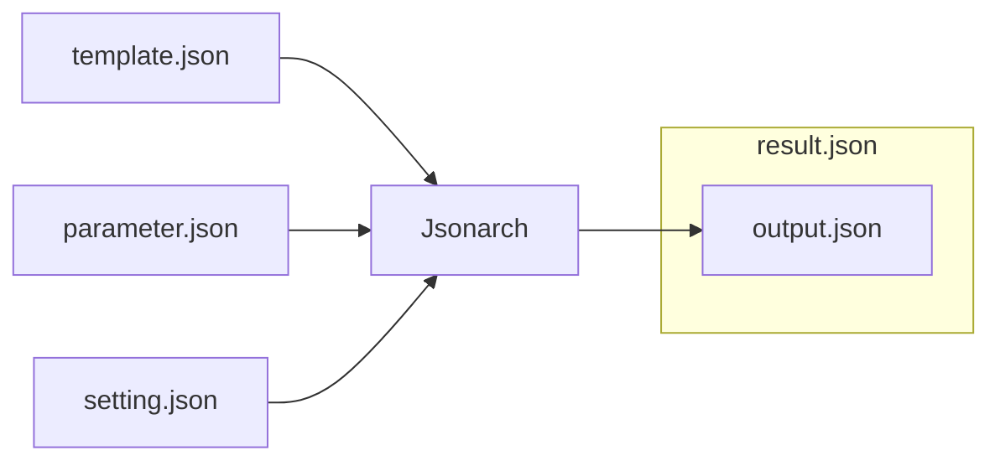

# Jsonarch

Jsonarch is JSON to JSON processor.

🚧 UNDER CONSTRUCTION 🚧

## Feature

- secure meta programmable JSON
- profiler ( systerm + code + data )
- origin map ( code + data )
- influence map ( code + data )
- call graph ( code )

## Overview



|Name|I/O|Decription|
|---|---|---|
|template.json|Input|Code|
|parameter.json|Input|Data ( optional )|
|setting.json|Input|Settings ( optional )|
|result.json|Output|output.json with meta data( profile result, origin map, influence map, call graph, etc )|
|output.json|Output|Generated JSON|

## How to use Jsonable as Command

```sh
jsonarch -t template.json -p parameter.json -s setting.json -r result.json -o output.json
```

See [Jsonarch Commandline Tool Reference](./document/commandline.md) for details.

## How to use Jsonable as Module

```ts
import { Jsonarch } from "jsonarch";

Jsonarch.compile();
```

See [Jsonarch Module Reference](./document/module.md) for details.

## How to build

requires: [Node.js](https://nodejs.org/), [TypeScript Compiler](https://www.npmjs.com/package/typescript)

`tsc -P ./source` or `tsc -P ./source -w`

## JSON Schemas

- [template.json JSON Schema](./json-schema/template-json-schema.json)
- [setting.json JSON Schema](./json-schema/setting-json-schema.json)

## Samples

- [Jsonarch Samples](./sample/index.md)

## References

- [Jsonarch Reference](./document/reference.md)
- [Jsonarch Module Reference](./document/module.md)
- [Jsonarch Commandline Tool Reference](./document/commandline.md)
- [Jsonarch Schema Reference](./document/schema.md)

## License

- [Boost Software License](LICENSE_1_0.txt)
