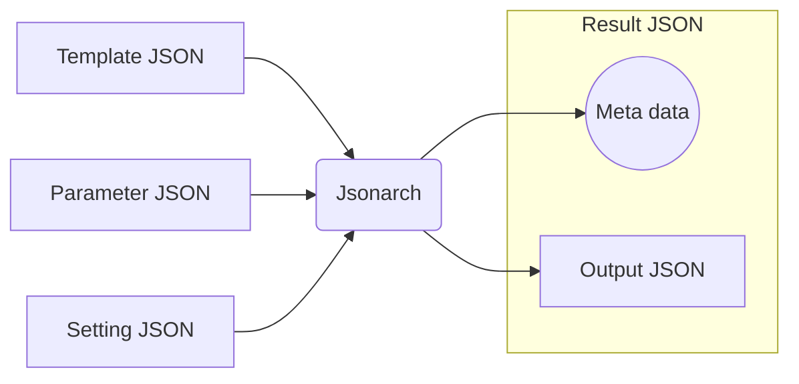

# Jsonarch Reference

Jsonarch is JSON to JSON processor for JavaScript/TypeScript, Commandline( requires [Node.js](https://nodejs.org/) ).

## Feature

- Secure meta programmable JSON
- Profiler ( systerm, code, data )
- Origin map ( code, data )
- Influence map ( code, data )
- Call graph ( code )

## Overview

|File|Description|
|---|---|
|Template JSON|Code|
|Parameter JSON|Data ( optional )|
|Setting JSON|Settings ( optional )|
|Result JSON|Output JSON with meta data( profile result, origin map, influence map, call graph, etc )|
|Output JSON|Generated JSON|

## Sequence

### Process Sequence

1. Load Setting JSON as Template JSON with boot Setting JSON.
2. Load Template JSON.
3. Load Parameter JSON.

### File Load Sequence

1. Resolve path.
2. Load from cache, if any.
3. Load by handler, if any. ( module only. Handlers cannot be specified on the command line. )
4. Load by `XMLHttpRequest` or `fetch` or `fs`.

## commandline tool

see [Jsonarch Commandline Tool Reference](./commandline.md)

## Setting JSON

see [setting.json schema reference](./reference.md#setting.json)

## $arch Statements

## Functions

## Types
