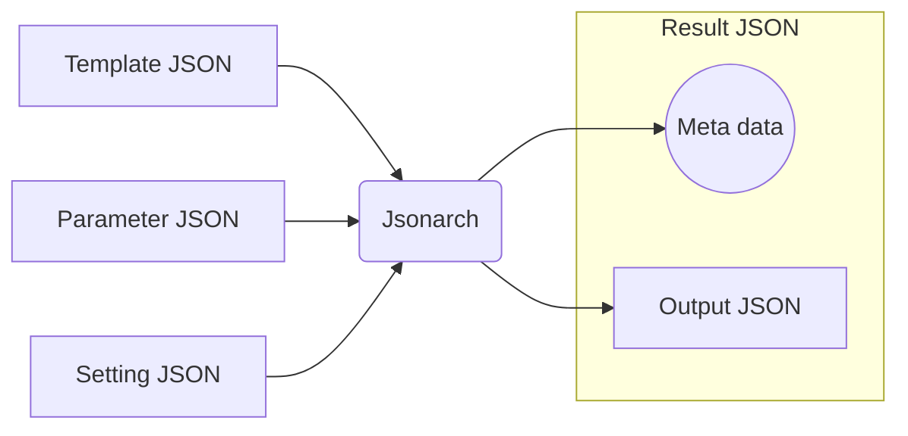

# Jsonarch Reference

Jsonarch is JSON to JSON processor.

## Feature

- Secure meta programmable JSON
- Profiler ( systerm + code + data )
- Origin map ( code + data )
- Influence map ( code + data )
- Call graph ( code )

## Overview

|File|I/O|Decription|
|---|---|---|
|Template JSON|Input|Code|
|Parameter JSON|Input|Data ( optional )|
|Setting JSON|Input|Settings ( optional )|
|Result JSON|Output|Output JSON with meta data( profile result, origin map, influence map, call graph, etc )|
|Output JSON|Output|Generated JSON|

## commanline tool

see [Jsonarch Commandline Tool Reference](./commandline.md)

## Setting JSON

see [setting.json schema reference](./reference.md#setting.json)

## $arch Statements

## Functions

## Types
