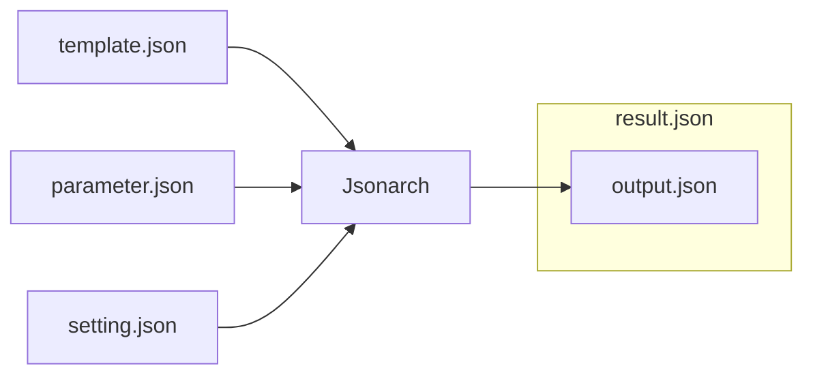

# Jsonarch Reference

Jsonarch is JSON to JSON processor.

## Feature

- secure meta programmable JSON
- profiler ( systerm + code + data )
- origin map ( code + data )
- influence map ( code + data )
- call graph ( code )

## Overview

|Name|I/O|Decription|
|---|---|---|
|template.json|Input|Code|
|parameter.json|Input|Data ( optional )|
|setting.json|Input|Settings ( optional )|
|result.json|Output|output.json with meta data( profile result, origin map, influence map, call graph, etc )|
|output.json|Output|Generated JSON|

## commanline tool

see [Jsonarch Commandline Tool Reference](./commandline.md)

## setting.json

see [setting.json schema reference](./reference.md#setting.json)

## $arch Statements

## Functions

## Types
